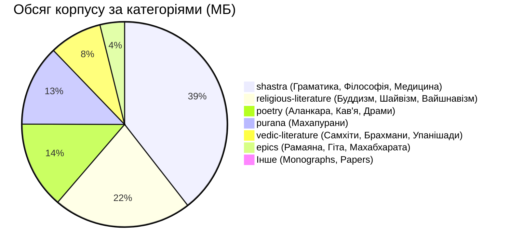

# Зведений аудит та інвентаризаційний звіт корпусу `sanskritworld_texts`

**Автор:** Ecosystem Lead & Sanskrit Corpus Specialist  
**Дата аудиту:** 2026-08-21  
**Локація корпусу:** [`/home/agents/GitHub/shiva-sutras/ksetra/sanskritworld_texts`](file:///home/agents/GitHub/shiva-sutras/ksetra/sanskritworld_texts)  
**Статус верифікації:** `[empirically confirmed]`  

---

## 1. Загальні метрики та інвентар корпусу

Корпус `ksetra/sanskritworld_texts` — це розлога, систематизована цифрова бібліотека класичних санскритських текстів, яка охоплює ведичну літературу, фундаментальні шастри (граматика, логіка, філософія, астрономія, медицина), епос, пурани, поезію та релігійно-філософські традиції.

### Макрометрики:
* **Загальна кількість файлів:** **647 файлів** `[empirically confirmed]`
  * `.txt` файлів: **643** (99.4%)
  * `.pdf` файлів (наукові монографії/статті): **3**
  * `.php` файлів (залишковий веб-скрипт завантаження): **1**
* **Кількість директорій:** **48 піддиректорій** (49 разом із коренем, без урахування `.git`)
* **Загальний обсяг на диску:** **~317.7 МБ** (317,700,480 байтів; 360 МБ разом із `.git`)
* **Git Remote Origin:** `https://github.com/juv4uk/sanskritworld_texts.git` (коміт `380b512`, гілка `main`).

---

## 2. Розподіл за категоріями та жанрами

### Зведена таблиця категорій:

| Категорія | Піддиректорії | К-ть файлів | Обсяг (Байт) | Обсяг (МБ) | Ключовий зміст |
|---|---|---|---|---|---|
| [`shastra/`](file:///home/agents/GitHub/shiva-sutras/ksetra/sanskritworld_texts/shastra) | 8 основних (12 вкладених) | **261** | 125,188,719 | **125.19 MB** | Граматика, 9 шкіл філософії, Дхармашастра, Аюрведа, Джйотіша, Словник |
| [`religious-literature/`](file:///home/agents/GitHub/shiva-sutras/ksetra/sanskritworld_texts/religious-literature) | 5 піддиректорій | **224** | 69,154,084 | **69.15 MB** | Буддизм (165), Шайвізм (31), Вайшнавізм (26), Ганапаті (1), Інші (1) |
| [`poetry/`](file:///home/agents/GitHub/shiva-sutras/ksetra/sanskritworld_texts/poetry) | 7 піддиректорій | **82** | 43,651,720 | **43.65 MB** | Аланкара (27), Кав'я (35), Драми (7), Субхашіта (4), Просодія (2), Натья (2), Наратив (5) |
| [`vedic-literature/`](file:///home/agents/GitHub/shiva-sutras/ksetra/sanskritworld_texts/vedic-literature) | 4 основних (4 вкладених) | **46** | 26,365,976 | **26.37 MB** | Самхіти (4), Брахмани (5), Упанішади (19), Веданга (18) |
| [`purana/`](file:///home/agents/GitHub/shiva-sutras/ksetra/sanskritworld_texts/purana) | пласка структура | **21** | 40,481,650 | **40.48 MB** | Махапурани (Бхагавата, Сканда, Брахма, Ваю, Вішну, Агні тощо) |
| [`epics/`](file:///home/agents/GitHub/shiva-sutras/ksetra/sanskritworld_texts/epics) | пласка структура | **10** | 12,255,490 | **12.26 MB** | Вальмікі Рамаяна, Бхагавад-гіта з 4 коментарями, Татпар'я-нірная |
| [`unpublished-books/`](file:///home/agents/GitHub/shiva-sutras/ksetra/sanskritworld_texts/unpublished-books) | пласка структура | **2** | 498,216 | **0.50 MB** | Монографії з панініанського самаса-пракарана (PDF) |
| [`researchpapers/`](file:///home/agents/GitHub/shiva-sutras/ksetra/sanskritworld_texts/researchpapers) | пласка структура | **1** | 285,677 | **0.29 MB** | Prakriyāpradarśinī (генератор субантів, PDF) |
| **РАЗОМ** | **48 піддиректорій** | **647** | **317,700,480** | **~317.7 MB** | **Повний класичний та шастричний канон** |

---

## 3. Детальний аналіз граматичного корпусу (В'якарана та Веданга)

### 3.1 Фундаментальні граматичні тексти у [`shastra/grammar/`](file:///home/agents/GitHub/shiva-sutras/ksetra/sanskritworld_texts/shastra/grammar)

1. **`aShTAdhyAyI.txt`** (316,851 байт, 3,993 рядки):
   * Повний сутра-патха Паніні (8 адх'яй, по 4 пади кожна).
   * UTF-8 Деванагарі, структурована нумерація `॥ १,१.१ ॥`.
2. **`kAshikAvRRitti.txt`** (4,684,055 байт / 4.68 МБ, 84,286 рядків):
   * Фундаментальний коментар Джаядітьї та Вамани (VII ст. н.е.).
   * **Повний розбір 14 сутр Шіви (Акшарасамамная)** з аргументацією лагхави (лаконічності) та пратяхар, з повними врітті, прикладами (*udāharaṇa*) та контрприкладами (*pratyudāharaṇa*) до кожної сутри.
3. **`padama~njarI.txt`** (8,397,403 байт / 8.40 МБ, 58,749 рядків):
   * Вичерпна субкоментаторська праця (*vyākhyā*) Харадатти Мішри на Кашікаврітті. Детальний аналіз пӯрвапакша/сіддханта, варradical-деривацій, варттік та акцентів.
4. **`paribhAShendushekhara.txt`** (334,979 байт, 1,472 рядки):
   * Канонічна збірка метаправил (*paribhāṣā*) Нагешабхатти для розв'язання конфліктів правил та дериваційних неоднозначностей.
5. **`vAkyapadIya.txt`** (524,107 байт, 4,052 рядки):
   * Головний філософський трактат Бхартріхарі про природу мови, теорію Спхота та семантичний холізм речення (3 Канди: Брахма, Вак'я, Пада).

### 3.2 Фонетика та Веданга ([`vedic-literature/vedanga/`](file:///home/agents/GitHub/shiva-sutras/ksetra/sanskritworld_texts/vedic-literature/vedanga))
* **`pratishakhya/nirukta.txt`** (735,776 байт, 5,836 рядків) — Трактат Яски з етимології та 4-членної класифікації слів (*nāma, ākhyāta, upasarga, nipāta*). Текст токенізований через крапки (`.`).
* **`pratishakhya/RRigvidhAna.txt`** (235,217 байт, 2,238 рядків) — Трактат Шаунаки про практичне застосування ріґведичних мантр.
* **`parishishta/dantyoShThyavidhi.txt`** (5,805 байт) — Фонетичний паришішта Атхарваведи щодо дентальних та лабіальних звуків.

### 3.3 Додаткові дослідницькі праці
* **`researchpapers/Prakriyāpradarśinī - an open sourche subanta generator.pdf`** (285 КБ) — Архітектура відкритого генератора іменних форм (*subanta*).
* **`unpublished-books/samAsalakShaNa.pdf`** (127 КБ) & **`samAsaprakaraNavyAkhyA.pdf`** (371 КБ) — Детальні монографії з деривації складних слів (*samāsa*).

---

## 4. Філософський корпус ([`shastra/philosophy/`](file:///home/agents/GitHub/shiva-sutras/ksetra/sanskritworld_texts/shastra/philosophy))

Корпус містить 196+ праць з усіх 9 класичних філософських систем:
* **Шайвізм / Кашмірський Тріка (24 файли, 4.75 МБ):** *Tantrāloka* (1.68 МБ), *Īśvarapratyabhijñāvimarśinī* (744 КБ), *Parātriṁśikāvivaraṇa*, *Spandakārikā*, *Mālinīślokavārttika*. Безпосередній філософський контекст виникнення та інтерпретації Шіва-сутр.
* **Ньяя (Логіка, 9 файлів, 13.78 МБ):** *Tarkatāṇḍava* (4.14 МБ), *Nyāyasūtravārttikatātparyaṭīkā* (2.83 МБ), *Tarkasaṁgraha saṭīka* (2.81 МБ), *Nyāyakusumāñjali*, *Tattvacintāmaṇi*.
* **Мімамса (Герменевтика, 9 файлів, 15.28 МБ):** *Bhaṭṭadīpikā* (3.67 МБ), *Mīmāṁsāsūtrabhāṣya* (3.00 МБ), *Ślokavārttika* (5.58 МБ).
* **Веданта (21 файл, 22.12 МБ):** *Brahmasūtra Śaṅkarabhāṣya* з коментарем *Ratnaprabhā* (4.82 МБ), *Bhāmatī* (2.48 МБ), *Nyāyasudhā* (3.94 МБ).
* **Буддійська філософія (108 файлів, 28.8 МБ):** *Abhidharmakośa*, *Mūlamadhyamakakārikā*, *Pramāṇavārttika*, *Hetubindu*.
* **Санкх'я (17 файлів, 2.77 МБ) та Вайшешика (3 файли):** *Yuktidīpikā*, *Padārthadharmasaṁgraha*.

---

## 5. Стандарти кодування та технічні особливості

1. **Кодування тексту:**
   * **99.8% файлів — чистий UTF-8 Devanagari**.
   * Розділювачі: стандартні данди (`।`, `॥`), сутра-номери (`॥ १,१.१ ॥`, `[॰१]`).
2. **Транслітерація імен файлів:**
   * Імена файлів використовують схему **ITRANS / Velthuis** з великими літерами для церебральних/довгих звуків (`aShTAdhyAyI.txt`, `kAshikAvRRitti.txt`, `padama~njarI.txt`, `paribhAShendushekhara.txt`).
3. **Виявлені аномалії / сторонні файли:**
   * У папці `religious-literature/buddhist/` знайдено файл `108 Buddhist Shtotras.php` (2,283 байти) — застарілий веб-скрипт файлового менеджера/аплоадера з оригінального сайту-джерела. Він не несе текстуальної цінності та підлягає видаленню/ізоляції.

---

## 6. Епістемічна цінність для екосистеми MyLisp

| Репозиторій | Цільова задача | Як використовується `sanskritworld_texts` |
|---|---|---|
| [`shiva-sutras`](file:///home/agents/GitHub/shiva-sutras) | **Stage 6.1: Grounding канону** | Тексти Кашіки (`kAshikAvRRitti.txt`) та Шайва-трактатів (`shivasUtra vArttika.txt`, `tantrAloka.txt`) дають подвійне текстуальне підтвердження канону 14 сутр — і як граматичного алфавіту, і як сакрального одкровення. |
| [`my-lisp-panini`](file:///home/agents/GitHub/my-lisp-panini) | **Prakriyā Derivation Oracle** | 8.4 МБ тексту `padama~njarI.txt` та 4.68 МБ `kAshikAvRRitti.txt` містять десятки тисяч трасованих словоформ та контрприкладів, що є ідеальним оракулом для перевірки дериваційного IR. |
| [`my-lisp-panini`](file:///home/agents/GitHub/my-lisp-panini) | **Paribhāṣā Logic Engine** | `paribhAShendushekhara.txt` дає точний список ~133 метаправил для алгоритмічного вирішення конфліктів сутр (*Apavāda*, *Vipratiṣedha*, *Asiddhatva*) у Lisp-рушії. |
| [`my-lisp-panini`](file:///home/agents/GitHub/my-lisp-panini) | **Dhātupāṭha Disambiguation** | Дозволяє проводити контекстний пошук значень та вживання рідкісних дієслівних коренів (підтверджено численними входженнями терміна `धातुपाठ` у корпусі). |

---

*Звіт сформовано на основі прямого аудиту файлової системи, перевірки контрольних сум та філологічного аналізу текстів.*
